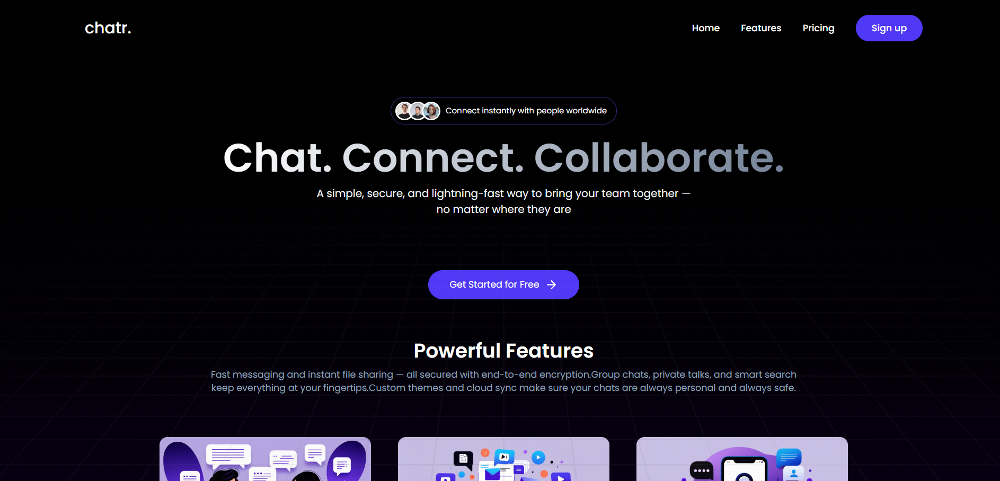

## Chatr

A full-stack real-time chat application with user authentication, friend system, and file sharing. Built with React + Vite frontend and Express + MongoDB backend with Socket.IO for real-time messaging.

### Preview


### Features
- **Real-time Messaging**: Instant messaging with Socket.IO
- **User Authentication**: Complete auth system with JWT and bcrypt
- **Friend System**: Send/accept friend requests and manage connections
- **File Sharing**: Image upload and sharing with Cloudinary integration
- **User Profiles**: Customizable user profiles with avatar support
- **Online Status**: Real-time online/offline user status
- **Message Status**: Read receipts and message delivery status
- **Modern UI**: React 19, Tailwind CSS 4, Lucide icons, toast notifications
- **Responsive Design**: Mobile-first responsive interface
- **Search Users**: Find and connect with other users
- **Dashboard**: Comprehensive dashboard with multiple views

### Tech Stack
**Frontend:**
- React 19 with Vite 7
- Tailwind CSS 4 with Vite plugin
- React Router DOM 7
- Socket.IO Client 4
- Axios for API calls
- React Hot Toast for notifications
- Lucide React for icons
- Moment.js for date formatting
- React Typewriter effects
- Lodash debounce for search optimization

**Backend:**
- Node.js with Express 5
- MongoDB with Mongoose 8
- Socket.IO 4 for real-time communication
- JWT for authentication
- bcryptjs for password hashing
- Cloudinary for file storage
- Multer for file uploads
- CORS for cross-origin requests

**Development Tools:**
- ESLint for code linting
- Nodemon for development
- Vercel deployment configuration

### Project Structure
```text
Chatr/
  app/                          # React + Vite frontend
    src/
      Pages/
        Dashboard/              # Dashboard components
      components/               # Reusable UI components
      context/
      assets/                  # Static assets
      main.jsx                 # App bootstrap
      App.jsx                  # Main app with routing
  server/                      # Express backend
    configs/ 
    controllers/
    middleware/
    models/
    routes/
    uploads/                   # Temporary file storage
    server.js                  # Main server file with Socket.IO
    package.json
    vercel.json               # Vercel deployment config
  README.md
```

### Prerequisites
- Node.js 18+ and npm
- MongoDB connection string
- Cloudinary account (for file uploads)

### Environment Variables
Create two `.env` files—one for the frontend and one for the backend.

**Frontend:** `app/.env`
```bash
VITE_CLERK_PUBLISHABLE_KEY=your_clerk_publishable_key
```

**Backend:** `server/.env`
```bash
MONGODB_URL=your_mongodb_connection_url
CLERK_SECRET_KEY=your_clerk_secret_key
CLERK_WEBHOOK_SECRET=your_clerk_webhook_secret
CLOUDINARY_CLOUD_NAME=your_cloudinary_cloud_name
CLOUDINARY_API_KEY=your_cloudinary_api_key
CLOUDINARY_API_SECRET=your_cloudinary_api_secret
JWT_SECRET=your_jwt_secret_key
```

### Installation
Install dependencies in both workspaces:
```bash
# Frontend dependencies
cd app && npm install

# Backend dependencies
cd ../server && npm install
```

### Running Locally
Open two terminals:

**1) Frontend (Vite dev server):**
```bash
cd app
npm run dev
```
The frontend will run on `http://localhost:5173`

**2) Backend (Express + Socket.IO):**
```bash
cd server
npm start
```
The backend will run on `http://localhost:3002`

### Scripts
**Frontend (`app`):**
- `npm run dev` – Start Vite dev server
- `npm run build` – Production build
- `npm run preview` – Preview built app locally
- `npm run lint` – Lint the frontend codebase

**Backend (`server`):**
- `npm start` – Start the server with Nodemon

### Database Schema
**User Model:**
- Authentication credentials
- Profile information (name, avatar, bio)
- Friends list and pending requests
- Online status

**Chat Model:**
- Chat participants
- Chat metadata
- Last message reference

**Message Model:**
- Message content and type
- Sender and chat references
- Timestamps and read status
- File attachments

### Features in Detail
**Authentication System:**
- JWT-based authentication
- Password hashing with bcrypt
- Protected routes and middleware
- User registration and login

**Real-time Messaging:**
- Socket.IO integration
- Message delivery and read receipts
- Online/offline status tracking
- Room-based chat organization

**Friend System:**
- Send and receive friend requests
- Accept/decline functionality
- Friends list management
- User search and discovery

**File Sharing:**
- Cloudinary integration for image storage
- Multer middleware for file uploads
- Image preview and sharing in chats
- Profile avatar uploads

### Deployment
The project includes Vercel configuration for easy deployment:
- Frontend: Deploy the `app` directory
- Backend: Deploy the `server` directory with `vercel.json` config

### Troubleshooting
- Ensure both `.env` files are present and correctly configured
- Verify MongoDB connection and database accessibility
- Check Cloudinary credentials for file upload functionality
- Confirm JWT secret is set for authentication
- Make sure both frontend and backend servers are running
- Verify Socket.IO connection on port 3002
- Check CORS configuration for cross-origin requests
